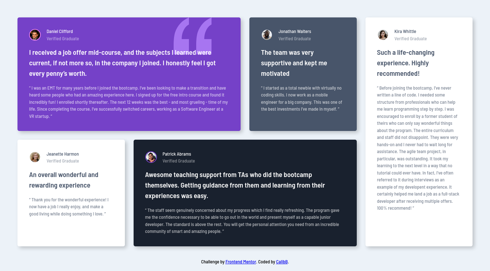
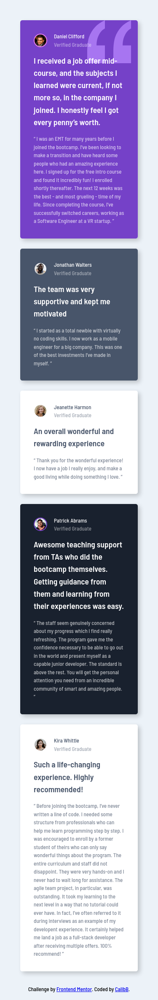

# Frontend Mentor - Testimonials grid section solution

This is a solution to the [Testimonials grid section challenge on Frontend Mentor](https://www.frontendmentor.io/challenges/testimonials-grid-section-Nnw6J7Un7). Frontend Mentor challenges help you improve your coding skills by building realistic projects. 

## Table of contents

- [Frontend Mentor - Testimonials grid section solution](#frontend-mentor---testimonials-grid-section-solution)
  - [Table of contents](#table-of-contents)
  - [Overview](#overview)
    - [The challenge](#the-challenge)
    - [Screenshot](#screenshot)
    - [Links](#links)
  - [My process](#my-process)
    - [Built with](#built-with)
    - [What I learned](#what-i-learned)
    - [Continued development](#continued-development)
    - [Useful resources](#useful-resources)
  - [Author](#author)

## Overview

### The challenge

Users should be able to:

- View the optimal layout for the site depending on their device's screen size

### Screenshot

### Links

- Solution URL: [Frontend Mentor](https://www.frontendmentor.io/solutions/testimonials-grid-section-challenge-8iRhWNyJm1)
- Live Site URL: [Github Pages](https://calibb.github.io/testimonials-grid-section-challenge/)

## My process

### Built with

- Semantic HTML5 markup
- CSS custom properties
- Flexbox
- CSS Grid
- [Sass](https://sass-lang.com/) - CSS preprocessor

### What I learned

My main purpose of this project was to apply what I learnt about CSS with the Sass preprocessor.

### Continued development

I mainly want to improve my CSS skills going forward.

### Useful resources

- [CSS MDN Docs](https://developer.mozilla.org/en-US/docs/Web/CSS) - I use this great reference when I can't remember what a paricular CSS property does.

## Author

- Frontend Mentor - [@CalibB](https://www.frontendmentor.io/profile/CalibB)
